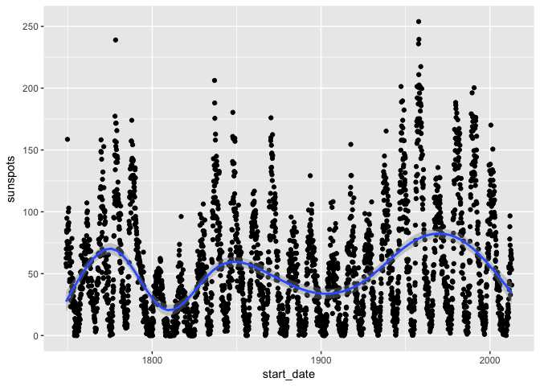

<!-- README.md is generated from README.Rmd. Please edit that file -->
transfrr
========

R package: Add summary information from one dataframe to the dataframe that has been summarized, given only starting posititions of summarized groups.

E.g. used when one dataframe consists of timestamped samples and another contains summary information about blocks of time.

Imagine a sampled heart rate with columns 'time' and 'signal' in one dataframe and information about events that happened in blocks of the sampling, with start times of the blocks, in the other dataframe. See Examples.

By Ludvig R. Olsen,
Cognitive Science, Aarhus University.
Started in Oct. 2016

Contact at: <r-pkgs@ludvigolsen.dk>

Main functions:

-   transfer

Installation
------------

Dependencies:

> install.packages("devtools")
>
> install.packages("groupdata2")

Development version:

> devtools::install\_github("LudvigOlsen/transfrr")

<!-- ## Functions   -->
<!-- ### transfer()   -->
Examples
--------

### Attach Packages

``` r
library(transfrr)
library(dplyr)
library(knitr)
library(ggplot2)
```

### Load data

``` r
sunspots <- sunspots_
presidents <- USA.presidents

sunspots %>% head(5) %>% kable()
```

|  sunspots|  year|  month| start\_date |
|---------:|-----:|------:|:------------|
|      58.0|  1749|      1| 1749-01-01  |
|      62.6|  1749|      2| 1749-02-01  |
|      70.0|  1749|      3| 1749-03-01  |
|      55.7|  1749|      4| 1749-04-01  |
|      85.0|  1749|      5| 1749-05-01  |

``` r
presidents %>% head(5) %>% kable()
```

|  presidency| president         | took\_office | party                 | home\_state   |
|-----------:|:------------------|:-------------|:----------------------|:--------------|
|           1| George Washington | 1789-04-30   | Independent           | Virginia      |
|           2| John Adams        | 1797-03-04   | Federalist            | Massachusetts |
|           3| Thomas Jefferson  | 1801-03-04   | Democratic-Republican | Virginia      |
|           4| James Madison     | 1809-03-04   | Democratic-Republican | Virginia      |
|           5| James Monroe      | 1817-03-04   | Democratic-Republican | Virginia      |

### Transferring presidents to the months of their presidency

``` r
transferred <- sunspots %>% 
  transfer(presidents, by = c("start_date", "took_office"))
```

``` r
# Notice: The first rows will contain NAs
# as there was no US president at the time
transferred %>% head(5) %>% kable()
```

|  sunspots|  year|  month| start\_date |  presidency| president | took\_office | party | home\_state |
|---------:|-----:|------:|:------------|-----------:|:----------|:-------------|:------|:------------|
|      58.0|  1749|      1| 1749-01-01  |          NA| NA        | NA           | NA    | NA          |
|      62.6|  1749|      2| 1749-02-01  |          NA| NA        | NA           | NA    | NA          |
|      70.0|  1749|      3| 1749-03-01  |          NA| NA        | NA           | NA    | NA          |
|      55.7|  1749|      4| 1749-04-01  |          NA| NA        | NA           | NA    | NA          |
|      85.0|  1749|      5| 1749-05-01  |          NA| NA        | NA           | NA    | NA          |

``` r
transferred %>% head(1000) %>% tail(5) %>% kable()
```

|  sunspots|  year|  month| start\_date |  presidency| president      | took\_office | party      | home\_state |
|---------:|-----:|------:|:------------|-----------:|:---------------|:-------------|:-----------|:------------|
|      28.9|  1831|     12| 1831-12-01  |           7| Andrew Jackson | 1829-03-04   | Democratic | Tennessee   |
|      30.9|  1832|      1| 1832-01-01  |           7| Andrew Jackson | 1829-03-04   | Democratic | Tennessee   |
|      55.6|  1832|      2| 1832-02-01  |           7| Andrew Jackson | 1829-03-04   | Democratic | Tennessee   |
|      55.1|  1832|      3| 1832-03-01  |           7| Andrew Jackson | 1829-03-04   | Democratic | Tennessee   |
|      26.9|  1832|      4| 1832-04-01  |           7| Andrew Jackson | 1829-03-04   | Democratic | Tennessee   |

``` r
transferred %>% tail(5) %>% kable()
```

|  sunspots|  year|  month| start\_date |  presidency| president    | took\_office | party      | home\_state |
|---------:|-----:|------:|:------------|-----------:|:-------------|:-------------|:-----------|:------------|
|      63.0|  2012|      8| 2012-08-01  |          44| Barack Obama | 2009-01-20   | Democratic | Illinois    |
|      61.4|  2012|      9| 2012-09-01  |          44| Barack Obama | 2009-01-20   | Democratic | Illinois    |
|      53.3|  2012|     10| 2012-10-01  |          44| Barack Obama | 2009-01-20   | Democratic | Illinois    |
|      61.8|  2012|     11| 2012-11-01  |          44| Barack Obama | 2009-01-20   | Democratic | Illinois    |
|      40.8|  2012|     12| 2012-12-01  |          44| Barack Obama | 2009-01-20   | Democratic | Illinois    |

``` r
# Plotting sunspots per president
ggplot(transferred, aes(president, sunspots)) +
  geom_violin() +
  theme(axis.text.x = element_text(angle = 90, hjust = 1))
```


``` r
# Plotting sunspots over time
ggplot(transferred, aes(start_date, sunspots)) +
  geom_point() +
  geom_smooth()
#> `geom_smooth()` using method = 'gam'
```


